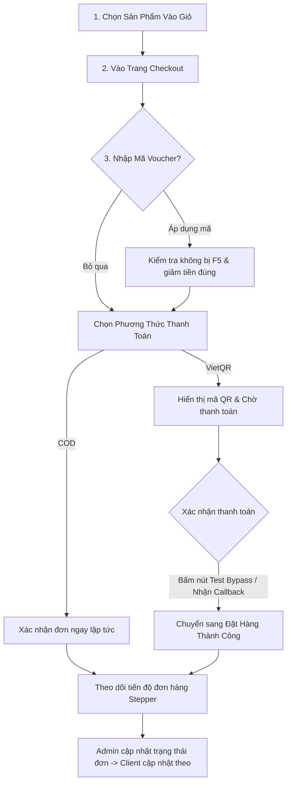

# 📋 BỘ TÀI LIỆU & KỊCH BẢN KIỂM THỬ HỆ THỐNG (TESTING CHECKLIST)
**Dự án:** L'SOUL Fashion E-Commerce Platform  
**Phiên bản:** v0.3.0  
**Cập nhật lần cuối:** 04/10/2026

---

## 📌 1. THÔNG TIN MÔI TRƯỜNG & TÀI KHOẢN KIỂM THỬ

### 🌐 Địa Chỉ Dịch Vụ
| Dịch vụ | Đường dẫn (URL) | Mục đích kiểm thử |
| :--- | :--- | :--- |
| **Storefront (Khách hàng)** | [http://localhost:3000](http://localhost:3000) | Mua hàng, Giỏ hàng, Áp Voucher, QR Payment, Theo dõi đơn |
| **Admin Portal (Quản trị)** | [http://localhost:3001](http://localhost:3001) hoặc `/admin` | Quản lý đơn hàng, đổi trạng thái vận chuyển, kho hàng |
| **Localtunnel Webhook Gateway** | Đang chạy nền trên cổng `3000` | Nhận webhook callback từ ngân hàng/cổng thanh toán VietQR |

### 👤 Tài Khoản Đăng Nhập Mẫu
| Vai trò | Email | Mật khẩu | Mục đích |
| :--- | :--- | :--- | :--- |
| **Quản trị viên (Admin)** | `admin@lsoul.local` | `Admin@123456` | Toàn quyền kiểm tra Admin Dashboard, sửa đơn |
| **Khách hàng 1** | `linh@lsoul.local` | `Lsoul@123456` | Khách VIP, có sẵn lịch sử đơn hàng và địa chỉ |
| **Khách hàng 2** | `nam@lsoul.local` | `Lsoul@123456` | Khách hàng thông thường |
| **Khách vãng lai** | Không cần đăng nhập | - | Kiểm thử mua hàng nhanh không cần tài khoản |

### 🏷️ Danh Sách Mã Giảm Giá (Voucher) Sẵn Có
| Mã Voucher | Loại giảm | Giá trị | Đơn tối thiểu | Giảm tối đa |
| :--- | :--- | :--- | :--- | :--- |
| `LSOUL10` | Phần trăm | 10% | 700.000đ | 250.000đ |
| `WELCOME15` | Phần trăm | 15% | 1.000.000đ | 350.000đ |
| `STYLE20` | Phần trăm | 20% | 1.800.000đ | 500.000đ |
| `AI200` | Tiền mặt | 200.000đ | 1.800.000đ | 200.000đ |

### 👗 Sản Phẩm Giá Hợp Lý Dành Cho Test Mua Hàng & Thanh Toán
| Tên sản phẩm | Màu sắc | Giá bán | Link trực tiếp |
| :--- | :--- | :--- | :--- |
| **Minimalist Seamless Ribbed Tank** | Trắng / Đen | 620.000đ | `/shop` (Lọc Tops) |
| **Signature Cotton Baby Tee** | Trắng / Đen | 650.000đ | `/shop` (Lọc Tops) |
| **Ribbed Square-Neck Crop Top** | Trắng / Đen / Be | 680.000đ | `/shop` (Lọc Tops) |
| **Seamless Halter Bodysuit** | Đỏ / Đen / Trắng | 850.000đ | `/shop` (Lọc Tops) |

---

## 🚀 2. CÁC KỊCH BẢN KIỂM THỬ TRỌNG TÂM (CORE TEST SCENARIOS)

---

### KỊCH BẢN 1: KIỂM THỬ ÁP MÃ VOUCHER TRONG CHECKOUT (ĐÃ SỬA LỖI F5)

- **Mục tiêu:** Đảm bảo khi ấn nút "Áp dụng" hoặc gõ Enter trong ô mã giảm giá, trang web **không bị reload (F5)** và số tiền chiết khấu được tính toán tức thì.
- **Các bước thực hiện:**
  1. Thêm 1 sản phẩm giá trên 700.000đ (hoặc 2 sản phẩm Baby Tee) vào giỏ hàng.
  2. Bấm vào Giỏ hàng -> Chọn **"Tiến hành đặt hàng"** để vào trang `/checkout`.
  3. Tại ô **"Mã giảm giá"**:
     - **Test Case 1.1 (Mã sai):** Nhập `TESTSAI` -> Bấm nút **Áp dụng** (hoặc nhấn phím Enter).
       - *Kỳ vọng:* Trang **KHÔNG** bị F5/reload lại; hiện thông báo lỗi màu đỏ rõ ràng (Mã không hợp lệ hoặc chưa đủ điều kiện).
     - **Test Case 1.2 (Mã hợp lệ):** Nhập `LSOUL10` -> Bấm nút **Áp dụng**.
       - *Kỳ vọng:* Trang không bị reload; thông báo áp mã thành công; mục "Giảm giá" xuất hiện trừ 10%; tổng tiền thanh toán giảm tương ứng.
     - **Test Case 1.3 (Hủy mã):** Bấm nút "Bỏ mã" hoặc dấu xóa.
       - *Kỳ vọng:* Tổng tiền khôi phục về ban đầu.

---

### KỊCH BẢN 2: KIỂM THỬ THANH TOÁN VIETQR & CỔNG CHỜ XÁC NHẬN

- **Mục tiêu:** Ngăn chặn việc tạo đơn thành công giả khi khách chưa thanh toán tiền QR. Khách chỉ được xác nhận thành công sau khi ngân hàng callback hoặc bấm xác nhận thử nghiệm.
- **Các bước thực hiện:**
  1. Tại trang Checkout, điền đầy đủ thông tin giao hàng (Họ tên, SĐT, Địa chỉ).
  2. Tại phần **Phương thức thanh toán**, chọn **"Chuyển khoản VietQR (Tự động xác nhận)"**.
  3. Bấm **"Hoàn tất đặt hàng"**.
  4. **Kiểm tra Phòng chờ thanh toán (Payment Waiting Room):**
     - Màn hình xuất hiện khung VietQR kèm mã QR chuyển khoản, số tài khoản, số tiền và nội dung chuyển khoản tự động.
     - Trạng thái đơn lúc này hiển thị: `Đang chờ thanh toán (Pending)`. Khách **chưa** nhận được thông báo "Đặt hàng thành công".
  5. **Xác nhận thanh toán:**
     - **Cách A (Test trên Local - Nhanh nhất):** Bấm vào nút màu xanh **"⚡ Xác nhận thanh toán thử nghiệm (Local Test)"** ngay dưới mã QR.
     - **Cách B (Test Webhook Ngân hàng qua Localtunnel):** Bắn POST request vào endpoint webhook với nội dung chuyển khoản khớp với mã đơn.
  6. **Kỳ vọng:**
     - Ngay sau khi xác nhận, hệ thống tự động nhận diện (polling mỗi 2.5s) và chuyển ngay sang màn hình **"🎉 Đặt hàng thành công!"**.
     - Trạng thái thanh toán cập nhật thành **"Đã thanh toán" (Paid)**.

---

### KỊCH BẢN 3: KIỂM THỬ THANH TOÁN KHI NHẬN HÀNG (COD)

- **Mục tiêu:** Khách chọn COD sẽ được xác nhận đặt hàng ngay lập tức mà không cần qua phòng chờ thanh toán QR.
- **Các bước thực hiện:**
  1. Thêm sản phẩm vào giỏ -> Vào Checkout.
  2. Chọn phương thức: **"Thanh toán khi nhận hàng (COD)"**.
  3. Bấm **"Hoàn tất đặt hàng"**.
  4. **Kỳ vọng:**
     - Chuyển thẳng tới màn hình "Đặt hàng thành công".
     - Trạng thái thanh toán hiển thị: `Chờ thanh toán khi nhận hàng`.

---

### KỊCH BẢN 4: KIỂM THỬ TIẾN ĐỘ ĐƠN HÀNG (ORDER TRACKER STEPPER)

- **Mục tiêu:** Kiểm tra giao diện Stepper 4 bước hiển thị đẹp mắt, không bị dính chữ (đã tách khối `div` title và description riêng biệt).
- **Các bước thực hiện:**
  1. Sau khi đặt hàng thành công, cuộn xuống phần **"Tiến độ đơn hàng"**.
  2. Kiểm tra 4 mốc thời gian:
     - **Bước 1:** `Đang xử lý` (Đơn hàng đã được tiếp nhận)
     - **Bước 2:** `Đã xác nhận` (Đang chuẩn bị gói hàng)
     - **Bước 3:** `Đang giao hàng` (Đơn vị vận chuyển đang phát)
     - **Bước 4:** `Hoàn thành` (Giao hàng thành công)
  3. **Kỳ vọng hiển thị:**
     - Tên bước (in đậm) và phần mô tả phụ nằm trên **2 dòng riêng biệt**, có khoảng cách rõ ràng, không bị dính sát vào nhau trên cùng một hàng.
     - Vòng tròn icon của bước hiện tại có hiệu ứng nổi bật (Active/Highlight).

---

### KỊCH BẢN 5: KIỂM THỬ ADMIN DASHBOARD & ĐỔI TRẠNG THÁI VẬN CHUYỂN

- **Mục tiêu:** Đảm bảo trang Admin hoạt động trơn tru (không lỗi React #310), có thể duyệt và cập nhật đơn hàng.
- **Các bước thực hiện:**
  1. Truy cập [http://localhost:3001](http://localhost:3001) (hoặc [http://localhost:3000/admin](http://localhost:3000/admin)).
  2. Đăng nhập bằng tài khoản: `admin@lsoul.local` / `Admin@123456`.
  3. **Kiểm tra Dashboard:**
     - Xem tổng doanh thu, số lượng đơn hàng, biểu đồ đơn mới (đảm bảo không còn vấp lỗi hook render).
  4. **Kiểm tra Quản lý đơn hàng:**
     - Mở chi tiết đơn hàng vừa tạo ở Kịch bản 1/2.
     - Đổi trạng thái từ `processing` -> `confirmed` -> `shipping` (nhập mã vận đơn test `GHN888999`).
  5. **Kiểm tra phía Client:**
     - Khách hàng tải lại trang chi tiết đơn hàng -> Thấy thanh Stepper nhảy ngay sang bước `Đang giao hàng` kèm mã vận đơn.

---

### KỊCH BẢN 6: KIỂM THỬ CATALOG ẢNH FLAT-LAY CHỤP THẬT (28 MẪU MỚI)

- **Mục tiêu:** Kiểm tra 28 mẫu sản phẩm mới được sinh ảnh bằng Google AI hiển thị đồng nhất, chuẩn studio packshot (nền sáng, chụp phẳng, đúng màu vải).
- **Các bước thực hiện:**
  1. Vào trang [http://localhost:3000/shop](http://localhost:3000/shop).
  2. Kiểm tra các nhóm sản phẩm nổi bật:
     - **Dòng Đầm tiệc:** Xem Đầm yếm hở lưng Luna (`Đen`, `Trắng`, `Xanh ngọc`, `Đỏ`), Đầm cúp ngực Siren (`Trắng`, `Đỏ`), Đầm Celeste Maxi (`Đen`, `Đỏ`, `Trắng`).
     - **Dòng Corset ren:** Xem Corset ren thêu gọng boning (`Trắng Ivory`, `Đỏ Ruby`).
     - **Dòng Áo ống Satin:** Xem Áo ống cúp ngực Athena (`Đen satin`, `Trắng satin`).
     - **Dòng Quần & Chân váy:** Xem Quần Bermuda shorts, Quần Tweed shorts, Chân váy Tweed mini.
  3. **Kỳ vọng:**
     - Ảnh sắc nét, tỷ lệ 3:4 chuẩn studio e-commerce, không bị mờ hay vỡ hình.
     - Khi chuyển màu sắc (color variant), ảnh tương ứng đổi màu mượt mà.

---

### KỊCH BẢN 7: KIỂM THỬ TRỢ LÝ AI CHATBOT TƯ VẤN (GÓC DƯỚI PHẢI)

- **Mục tiêu:** Chatbot AI nhận diện đúng nhu cầu phối đồ và tự động đề xuất/áp dụng mã giảm giá.
- **Các bước thực hiện:**
  1. Bấm vào biểu tượng Chat AI ở góc dưới bên phải màn hình.
  2. **Test Case 7.1:** Nhắn *"Cho tôi xin mã giảm giá với"*
     - *Kỳ vọng:* AI trả lời danh sách mã `LSOUL10`, `WELCOME15` và hiện nút bấm nhanh để áp dụng.
  3. **Test Case 7.2:** Nhắn *"Tôi muốn tìm đầm dự tiệc màu đỏ sang trọng"*
     - *Kỳ vọng:* AI đề xuất đúng các mẫu đầm đỏ (`Celeste Maxi Red`, `Luna Halter Red`, `Siren Mini Red`).

---

## 📊 3. BẢNG CHECKLIST ĐÁNH GIÁ (TEST EXECUTION LOG)

Bạn có thể tích `[x]` vào bảng dưới đây khi hoàn thành từng mục kiểm thử:

| ID | Module kiểm thử | Nội dung kiểm tra | Kết quả mong đợi | Đánh giá (Pass/Fail) |
| :---: | :--- | :--- | :--- | :---: |
| **TC-01** | Checkout - Voucher | Nhập mã `TESTSAI` và bấm Áp dụng | Không F5 trang, báo lỗi đỏ rõ ràng | [ ] |
| **TC-02** | Checkout - Voucher | Nhập mã `LSOUL10` và ấn phím Enter | Không F5 trang, giảm 10% tổng tiền | [ ] |
| **TC-03** | Checkout - QR Flow | Chọn thanh toán VietQR | Hiện mã QR, trạng thái Chờ thanh toán | [ ] |
| **TC-04** | Checkout - QR Flow | Bấm nút Local Test Bypass | Tự động chuyển trang Đặt hàng thành công | [ ] |
| **TC-05** | Checkout - COD | Chọn thanh toán COD | Xác nhận đơn tức thì, không cần qua QR | [ ] |
| **TC-06** | UI - Stepper Tracker | Xem tiến độ đơn hàng | 4 bước chuẩn, tiêu đề và mô tả tách dòng | [ ] |
| **TC-07** | Admin - Dashboard | Mở trang `/admin` và duyệt danh sách | Không bị lỗi React #310, nạp dữ liệu mượt | [ ] |
| **TC-08** | Admin - Order Flow | Đổi trạng thái đơn sang shipping | Client cập nhật đúng mốc Đang giao hàng | [ ] |
| **TC-09** | Shop - Image Catalog | Xem các mẫu Đầm & Corset mới | 28 ảnh flat-lay chụp thật hiển thị sắc nét | [ ] |
| **TC-10** | AI - Assistant | Hỏi mã giảm giá và phối đồ qua Chat | AI phản hồi chuẩn, đề xuất sản phẩm chính xác | [ ] |

---

## 🛠️ 4. HƯỚNG DẪN XỬ LÝ NHANH KHI GẶP SỰ CỐ (TROUBLESHOOTING)

1. **Nếu ảnh mới chưa hiện trên trình duyệt:**
   - Trình duyệt có thể lưu cache ảnh cũ. Nhấn tổ hợp phím `Ctrl + F5` (hoặc `Cmd + Shift + R`) để tải lại toàn bộ tài nguyên sạch.
2. **Nếu container Docker không nhận ảnh mới:**
   - Chạy lệnh đồng bộ: `npx tsx scripts/sync-generated-artifacts.ts` để tự động copy toàn bộ ảnh vào hai container `lsoul-web` và `lsoul-admin`.
3. **Nếu muốn khởi động lại toàn bộ hệ thống:**
   - Chỉ cần chạy file [run.bat](file:///c:/Users/Admin/BanHang/run.bat) hoặc [run-first-time.bat](file:///c:/Users/Admin/BanHang/run-first-time.bat) tại thư mục gốc.
